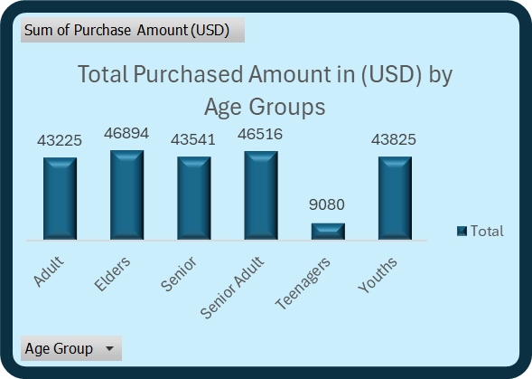
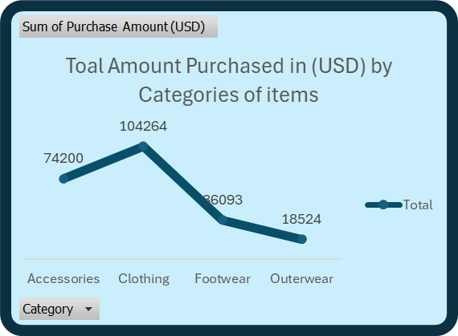
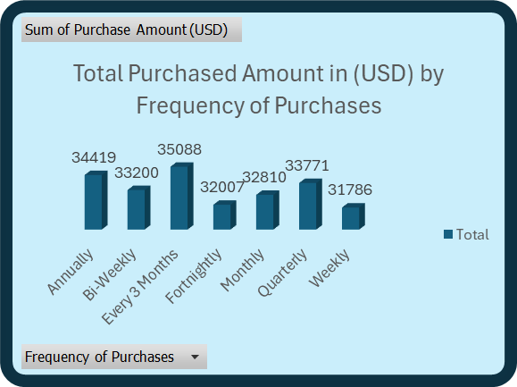
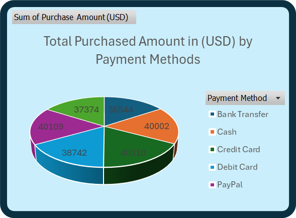
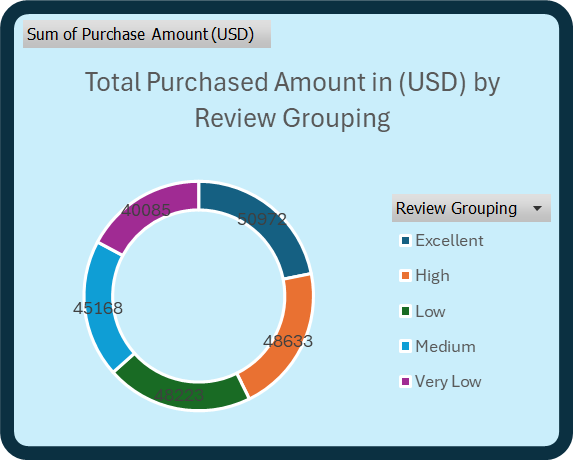
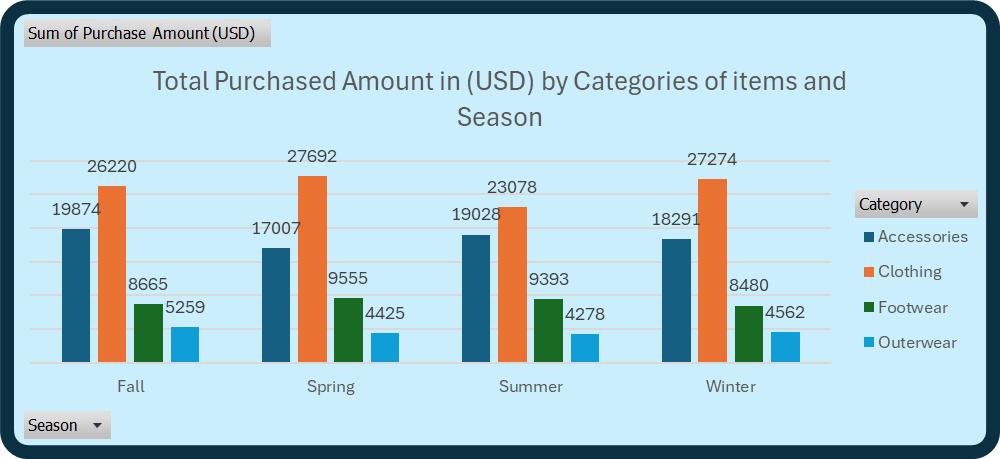
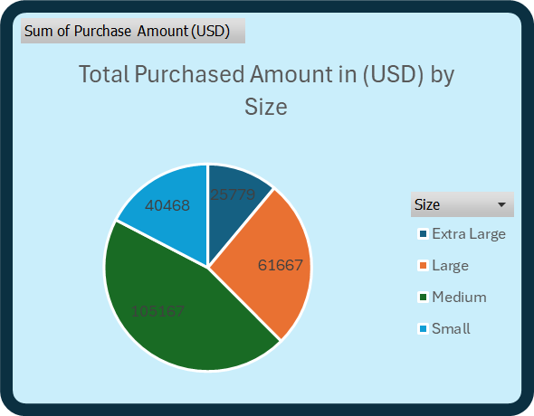
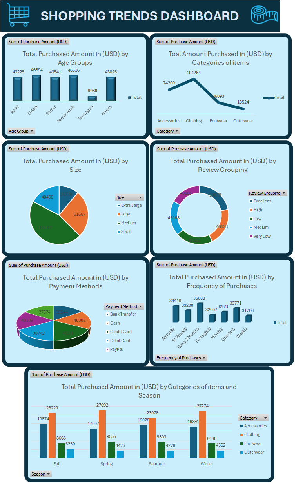

# Company XYZ

---

# Introduction

This is an excel project that aims to provide insights into shopping trends based on various factors, such as age group, product category, payment methods, and purchase frequency. The analysis visualized in the dashboard shows the total purchased amounts across multiple categories, helping businesses understand customer behavior and purchasing patterns.

**_Disclaimer_** : _All data set do not represent any company, institution or country, but just a dummy data set to demonstrate the capabilities of Excel._

## Problem Statement
1.  which **age groups** contribute the most to total purchase amounts.
2. which is the **most popular product categories** (Accessories, Clothing, Footwear, Outerwear) based on purchase amounts.
3. what **product size** (Small, Medium, Large, Extra Large) impacts purchasing behavior.
4. what is the relationship between **review groupings** (Excellent, High, Medium, Low, Very Low) and total purchases.
5. which is the **preferred payment methods** (Credit Card, Debit Card, Cash, PayPal, Bank Transfer) used by customers.
6. what is the influence of **purchase frequency** (Weekly, Monthly, Quarterly, Annually) on total purchase amounts.
7. what is the impact of **seasons** on purchases across different product categories (Fall, Winter, Spring, Summer).

## Data Sourcing
An imaginary shopping data set.

## Data Transformation
Before analysis, the raw data was cleaned and processed:
- I made sure that all fields in the dataset were properly formatted (e.g., date, text, integer, binary).
- Using Excel, I eliminated duplicates and cleaned the data to get it ready for analysis. 
- I also grouped the necessary rows and columns for the analysis.

## Analysis and Visualization.
I utilized bar charts, pie charts, line graph and other visualizations to represent data on products categories, age groups, frequency of purchases, and more. Through this analysis, it was revealed that clothing is the highest-selling product. 🤓
  
### Purchased Amount According to Age Groups

  ---
### Purchased Amount According to Categories of items.

---
### Purchased Amount According to Frequency.

---
### Purchased Amount According to Payment Method.

---
### Purchased Amount According to Rating.

---
### Purchased Amount According to Season.

---
### Purchased Amount According to Size.

---
### Shopping Dashboard.

---
## Conclusion 
The analysis reveals that:
- Adults and senior adults are the primary customer groups.
- Clothing is the dominant product category, especially during winter.
- Credit and debit cards are the most preferred payment methods.
- Positive reviews are linked to higher spending, indicating the importance of maintaining product quality.
- Most customers prefer to make purchases on a monthly or quarterly basis. 

## Recommendation
1. **Target Marketing**: Focus marketing efforts on the Adult and Senior Adult groups, especially promoting Clothing during the winter.
2. **Review Management**: Encourage customers to leave reviews and ensure product quality to leverage the positive correlation between reviews and sales.
3. **Seasonal Promotions**: Offer targeted discounts on clothing and footwear in winter to maximize revenue.
THANK YOU 😄

  

